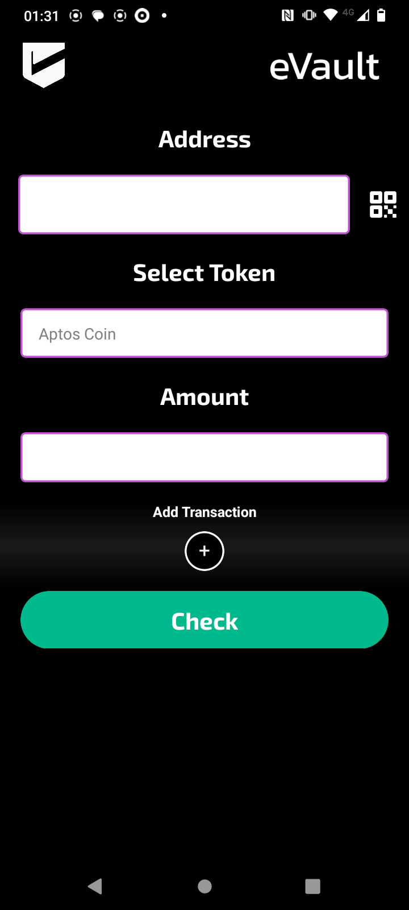

# eVault

eVault Wallet: Batch transactions, optimized savings, and seamless card payments.

## Fast Links:

WALLET CODE: [CODE](./ReactNativeApp/)

PLAYSTORE: [LINK](https://play.google.com/store/apps/details?id=com.altaga.evault)

VIDEO DEMO: [VIDEO](https://www.youtube.com/watch?v=na6mEfhuo74)

# System Diagrams:

- Main Account: Within the schematics you can see that we have our main wallet, which is a Non Custodial Wallet, to which you will have to save its mnemonic at the time of its creation.

- Savings Account: This wallet, like the previous one, is a Non Custodial Wallet, which will save the savings on each transaction according to the chosen savings protocol.

- Card Account: This wallet, the same as the previous one, is a Custodial Wallet, this, unlike being controlled through the Main Account, is controlled through the hash of the card that is merged when the account is created.

- Batch Transactions: Through Aptos network, it is possible to carry out several batch transactions using a single signature, this allows us all the incredible functionalities of our wallet.

# Introduction:

eVault is a blockchain wallet and platform that empowers underserved communities through saving. Employing novel Blockchain technologies through Aptos such as Batch transactions and optimized savings. It also combines it with TradFi via seamless card payments.

## Wallet:

Our main screen is our Main Account, which is a traditional wallet to manage our assets. All balances and coins are in **Mainnet** and the code for this screen is as follows. [CODE](./ReactNativeApp/src/screens/main/tabs/tab1.js)

## Send:

This screen is important and allows us to make simple or batch transfers from our wallet. And the code for this screen is the following. [CODE](./ReactNativeApp/src/screens/sendWallet/sendWallet.js)

 

It should be remembered that if the Savings account is active, one more transaction will be added to the final transfer to our savings account. All this is very easy to do with Aptos, even if Mastercard is one of its clients. [2](#references).

## Receive:

With this screen, you can easily show your Wallet to receive funds, whether Aptos or Coins y el codigo de esta pantalla es el siguiente. [CODE](./ReactNativeApp/src/screens/depositWallet/depositWallet.js) 

## Payment: 

In this tab we intend to make it the same as using a traditional POS, this allows us to enter the amount to be charged in American dollars and to be able to make the payment with one of our virtual cards. And this is the function code: [CODE](./ReactNativeApp/src/screens/paymentWallet/paymentWallet.js)

  

## Savings:

The savings account is a Non Custodial Wallet which allows us to have savings based on protocols. We will explain these protocols a little later. However, on this screen you can withdraw the savings according to the defined date and the code on this screen is the next. [CODE](./ReactNativeApp/src/screens/main/tabs/tab2.js)

  

### Savings Protocol:

- Balanced Protocol, this protocol performs a weighted rounding according to the amount to be paid in the transaction, so that the larger the transaction, the greater the savings, in order not to affect the user. And this is the function code: [CODE](./ReactNativeApp/src/utils/utils.js)

        export function balancedSavingToken(number, usd1, usd2) {
            const balance = number * usd1;
            let amount = 0;
            if (balance <= 1) {
                amount = 1;
            } else if (balance > 1 && balance <= 10) {
                amount = Math.ceil(balance);
            } else if (balance > 10 && balance <= 100) {
                const intBalance = parseInt(balance, 10);
                const value = parseInt(Math.round(intBalance).toString().slice(-2), 10);
                let unit = parseInt(Math.round(intBalance).toString().slice(-1), 10);
                let decimal = parseInt(Math.round(intBalance).toString().slice(-2, -1), 10);
                if (unit < 5) {
                unit = '5';
                decimal = decimal.toString();
                } else {
                unit = '0';
                decimal = (decimal + 1).toString();
                }
                amount = intBalance - value + parseInt(decimal + unit, 10);
            } else if (balance > 100) {
                const intBalance = parseInt(Math.floor(balance / 10), 10);
                amount = (intBalance + 1) * 10;
            }
            return new Decimal(amount).sub(new Decimal(balance)).div(usd2).toNumber();
        }

- Percentage protocol, unlike the previous protocol, this one aims to always save a percentage selected in the UI. And this is the function code: [CODE](./ReactNativeApp/src/utils/utils.js)

        export function percentageSaving(number, percentage) {
            return number * (percentage / 100);
        }

## Cards:

Finally, in the cards section, we can create a virtual card, which will help us make payments without the need for our wallet directly with a physical card in any POS terminal with eVault. And the code for this screen is the following. [CODE](./ReactNativeApp/src/screens/main/tabs/tab3.js)

 

The function codes to create a card and make transactions with it are as follows.

- [ADD CARD](./Cloud%20Functions/AddCard.js)
- [WITHDRAW CARD](./Cloud%20Functions/WithdrawCard.js)

# References:

1. https://blog.quicknode.com/aptos-network-quicknode-solving-blockchain-challenges-with-scalability-to-move-web3-towards-widespread-adoption/
2. https://aptosfoundation.org/use-cases/defi
3. https://medium.com/@idoexist99/aptos-the-speedy-new-blockchain-built-for-cool-dapps-2f39c55f8d56
